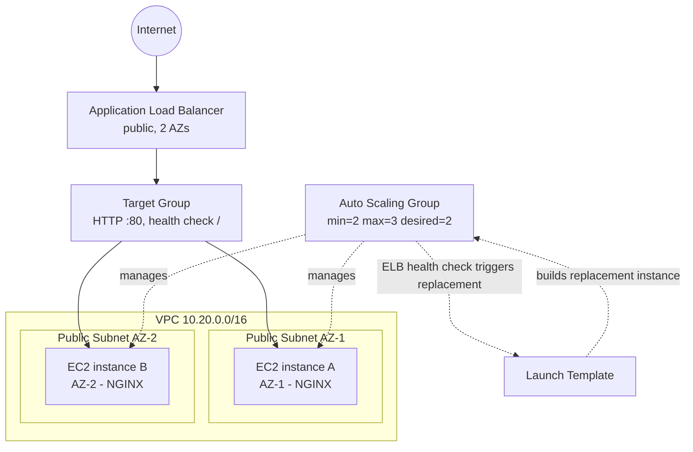

# Auto-Healing Web Tier (AWS, Terraform)

Stands up a self-healing, self-provisioning N+1 web tier: an Application
Load Balancer in front of an Auto Scaling Group of two (or more) EC2
instances, each serving a static NGINX welcome page. Terminate any single
instance and the ASG replaces it automatically, with zero downtime for
users hitting the load balancer.

## Why AWS over Azure

Both platforms can satisfy the brief equally well; AWS was chosen because:

- The ASG + ALB + Launch Template pattern is a very direct, minimal-moving-parts
  way to satisfy "self-healing" and "N+1 behind a load balancer" — an ASG's
  ELB health check + replacement behaviour *is* the self-healing mechanism,
  no extra glue needed.
- `t3.micro` + ALB fits comfortably inside typical AWS free-tier allowances,
  keeping this close to the AUD 20/month ceiling.
- Terraform's AWS provider is the most mature/first-class of the three allowed
  ecosystems, which keeps the module code simple and readable for review.

## Architecture



Traffic flow: Internet → ALB (spans both public subnets/AZs) → Target Group
→ whichever instances are currently healthy. The ASG continuously monitors
instance health via the ALB's health check; a failed or terminated instance
is deregistered and a replacement is launched from the Launch Template
automatically — this is the self-healing loop.

## Repository layout

```
.
├── main.tf                  # wires the three modules together
├── variables.tf / outputs.tf
├── versions.tf               # provider + required_version pin
├── terraform.tfvars.example  # copy to terraform.tfvars and edit
├── modules/
│   ├── network/               # VPC, IGW, 2 public subnets (2 AZs), route table
│   ├── security/               # ALB SG (80 from internet) + instance SG (80 from ALB only)
│   └── compute/                 # Launch Template, ASG, ALB, Target Group, Listener
├── docker/                    # bonus: Dockerfile + static page
└── .github/workflows/terraform.yml  # bonus: fmt/validate/plan CI, no apply
```

Naming convention: every resource name is prefixed with
`${project_name}-${environment}` (default `g360-autoheal-demo`), so multiple
environments/reviewers can coexist without collisions. Tags (`Project`,
`Environment`, `ManagedBy`, `Owner`) are applied to all resources via
`default_tags` on the provider.

## Prerequisites

- Terraform >= 1.7.0
- An AWS account + credentials available to the AWS provider (env vars,
  `~/.aws/credentials` profile, or SSO) — **only required if you intend to
  run `apply`; `plan` needs credentials too, since it reads live AMI data,
  but no resources are created until `apply` is run.**

## Steps to run

```bash
# 1. Clone and enter the repo
git clone <your-repo-url>
cd g360-autoheal-web

# 2. Copy and edit variables
cp terraform.tfvars.example terraform.tfvars

# 3. Initialise
terraform init

# 4. Format & validate (also run in CI)
terraform fmt -recursive
terraform validate

# 5. Plan (safe, read-only against live AWS APIs for AMI lookup)
terraform plan

# 6. (Optional) Apply
terraform apply

# 7. Test self-healing (only if you applied)
#    - open the alb_dns_name output in a browser, refresh a few times
#    - terminate one instance in the EC2 console or via CLI:
#      aws ec2 terminate-instances --instance-ids <id>
#    - watch the ASG launch a replacement (Activity tab / `aws autoscaling
#      describe-scaling-activities`), site stays reachable throughout

# 8. Idempotency check — re-running plan/apply with no changes should
#    report "No changes."
terraform plan

# 9. Tear down
terraform destroy
```

### Bonus: containerised page

Set `enable_container = true` and `container_image` in `terraform.tfvars`
to have each instance's user-data pull and run the Docker image instead of
installing NGINX directly. To publish the bundled sample image:

```bash
cd docker
docker build -t ghcr.io/<your-username>/g360-web:latest .
docker push ghcr.io/<your-username>/g360-web:latest
```

## Assumptions

- Region: `ap-southeast-2` (Sydney) — closest region to Melbourne/AU.
- No HTTPS/ACM certificate or custom domain — HTTP only, satisfies "static
  welcome page" scope; TLS termination on the ALB would be a natural next
  step (ACM cert + listener on 443 + redirect from 80).
- No SSH access is opened to instances (no key pair, no port 22 ingress) —
  fully reviewed via IaC + AWS Systems Manager Session Manager if shell
  access is ever needed; keeps the security group minimal.
- Public subnets only, no NAT gateway — instances get a public IP directly
  to reach package repos, which avoids the ~AUD 45+/month NAT Gateway cost
  entirely. Acceptable for this demo scope; a production build would put
  instances in private subnets behind a NAT Gateway or VPC endpoints.
- Single region, two AZs — satisfies N+1 across failure domains without a
  third AZ, which isn't required by the brief.
- Account is assumed to be within (or reasonably close to) the AWS Free
  Tier window; see cost notes below for the non-free-tier figure.

## Estimated monthly cost (ap-southeast-2, AUD, approximate)

| Resource | Assumption | Est. cost (free tier) | Est. cost (no free tier) |
|---|---|---|---|
| Application Load Balancer | always-on, minimal LCU usage | ~AUD 25 (ALB itself is not in free tier) | ~AUD 25 |
| 2x EC2 `t3.micro` | 730 hrs/month each | ~AUD 0 (750 free hrs/mo covers 1 instance) | ~AUD 23 |
| 2x EBS gp3 8GB | default AMI root volume | ~AUD 0 (30GB free tier) | ~AUD 2 |
| Data transfer | low-traffic demo | ~AUD 0–1 | ~AUD 0–1 |
| **Total** | | **~AUD 25–26** | **~AUD 50–51** |

**Honest note on the AUD 20 ceiling:** the ALB itself (~AUD 25/mo) is the
dominant cost and isn't free-tier eligible, so a fully-deployed, always-on
stack sits above AUD 20/month regardless of instance sizing. Because the
brief states *"provisioning the underlying infrastructure is completely
optional, we will only review `terraform plan` outputs"*, this design
prioritises correctness and clarity of the pattern over squeezing under the
budget for an always-on deployment. If a hard AUD 20 ceiling for an
always-on deployment were a firm requirement, the cheapest compliant
alternative would be swapping the ALB for two EC2 instances behind DNS-based
failover (Route 53 health checks) — cheaper, but a materially weaker
solution to "load balancer" and worse UX during failover. Recommend
`terraform destroy` shortly after any demo `apply` to keep actual spend
near zero.

## Idempotency & self-provisioning

- `terraform apply` run twice with no source changes: the second run
  reports `0 to add, 0 to change, 0 to destroy` — the ASG's `desired_capacity`
  is explicitly excluded from drift detection (`lifecycle.ignore_changes`)
  since the ASG is allowed to own that value after a scale-in/out event.
- Everything needed to stand the stack up — network, security groups,
  compute, load balancer — is created by a single `terraform apply`; no
  manual console steps required.

## Commit history

Commits are staged incrementally (network → security → compute → docs/CI)
to reflect the build process rather than a single squashed commit.
